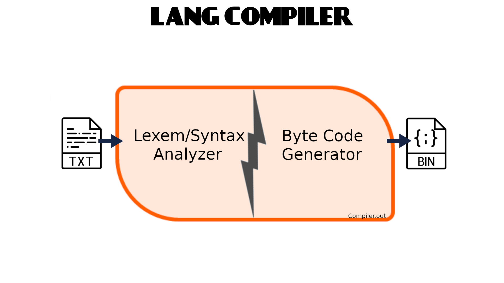
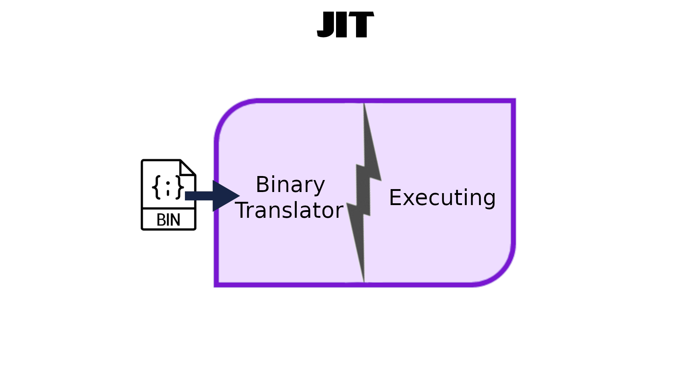
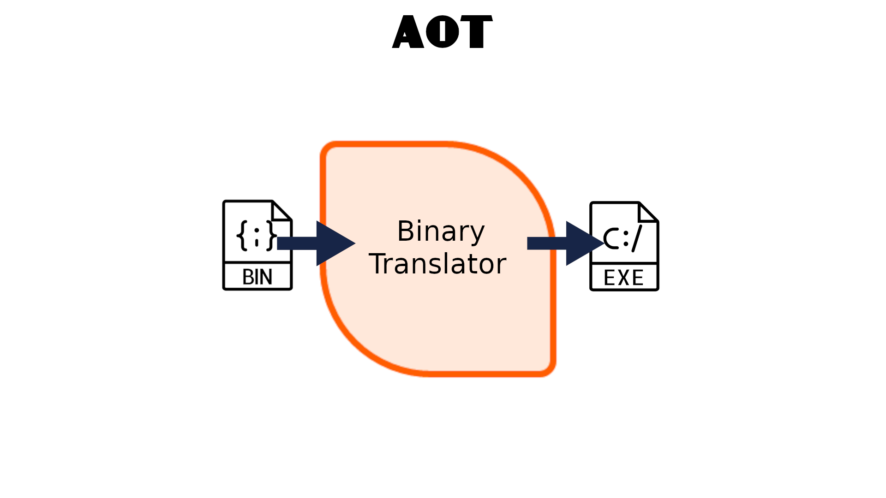
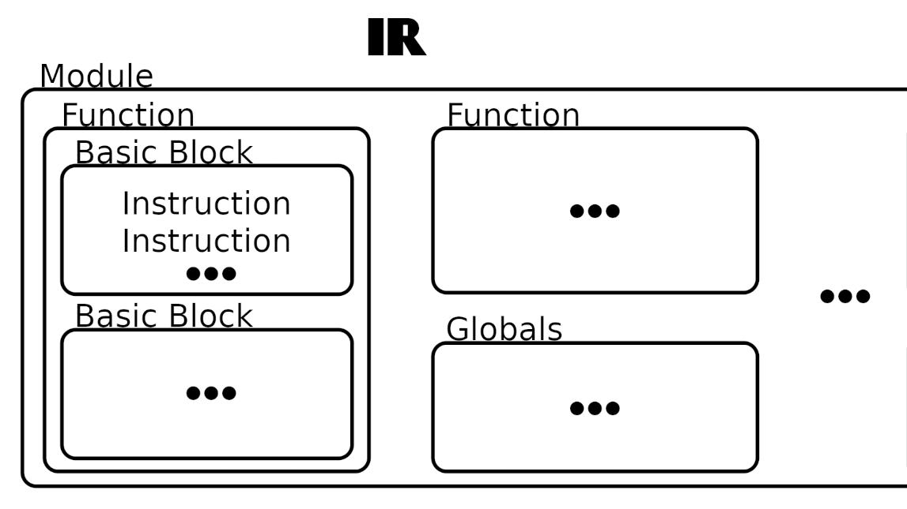
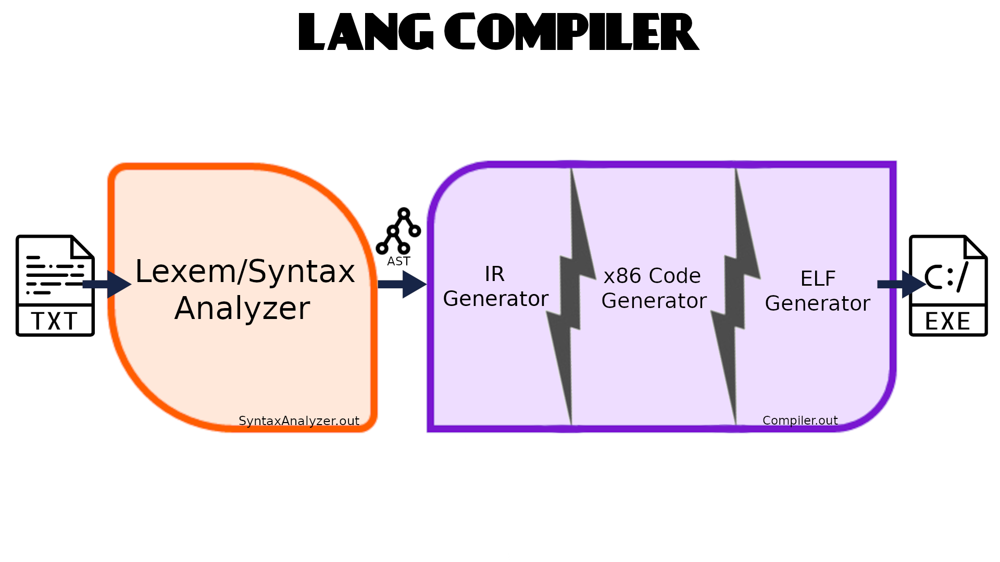
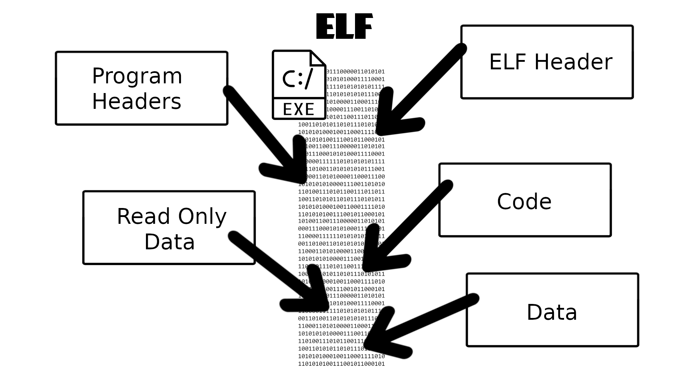

# Ускорение ПО путем замены формального исполнителя
_Выполнил Буторин Даниил_

> Jestem Rosjaninem, więc będę pisać po rosyjsku

## Введение
Одно из предыдущих заданий курса была реализация своего ЯП'а.
Его компилятор генерировал байт-код для `softcpu`(тоже своего).
У него была следующая архитектура:



К сожалению, у приложений написанных на этом ЯП'е низкая скорость исполнения.
Так как ЯП у нас компилируем и без `runtime'а`, 
то ускорять его не получится(Разве что добавить оптимизации при `Code Gen'е` байт-кода). 

Так как мы не `Sun Microsystems`, то `softcpu` работает достаточно медленно. 
Но к радости мы имеем более производительный `cpu` - 
аппаратный(Здесь и далее будем предполагать, что у нас процессор архитектуры x86-64). 
Им и воспользуемся.

Из вариантов того, как можно перевести наш ЯП в машинный код:
- Транслировать байт-код в машинный код
- Транслировать АСД ЯП в машинный код

Первый вариант предоставляет нам два варианта компилятора: `JIT`(Just-In-Time) и `AOT`(Ahead-Of-Time).

`JIT` подразумевает, что байт-код приложения в `runtime'е` будет транслирован в машинный код, а потом исполнен.


`AOT` аналогичен `JIT`, но компилятор не исполняет код, а генерирует исполняемый файл на его основе.

  
У технологии `JIT`  есть очевидный недостаток - трансляция занимает время. 
`AOT` решает эту проблему, но у него подчеркивается другая - крайне ограниченные возможности к оптимизации.
Так как при `Code Gen'е` байт-кода мы не используем оптимизации, то для нас эти технологии не представляют сильный интерес. 

Поэтому рассмотрим второй вариант. Можно транслировать АСД ЯП в машинный код напрямую, но при таком подходе тяжело оптимизировать код.
Исходя из "Dragon book"(aka "Компиляторы. Принципы, технологии и инструменты") мы знаем, что есть альтернативный вариант - использовать IR(промежуточное представление). 
Подробней его рассмотрим далее. Далее из `IR'а` будет генерироваться машинный код с оптимизациями.

## Промежуточное представление

Есть разные варианты `IR'а`, но для нас имеет набольший интерес трехадресный код.
Для наилучшего понимания вот общее представление такого кода:

```%Result = %Operand0 Operator %Operand1```

Исключением является команды перехода на ветку и возращения управления:

```
Br %Condition, %ThenBranch, %ElseBranch
Br %Branch 
Ret Null
Ret %Value
``` 

Также некоторые команды являются двухадресными.

Одна единица трансляции представляет собой модуль, который является множеством глобальных переменных и функций. 
Функция представляет собой множество базовых блоков. Базовый блок - это набор последовательно исполняемых инструкций. 
То есть базовый блок может начинаться с любой инструкции, а кончается инструкциями перехода на ветку или возвращения из подпрограммы.
Стоит упомянуть, что инструкция вызова подпрограмм не обрывает базовый блок, 
так как она не нарушает последовательное исполнение команд в нем(После данной инструкции гарантируется исполнение следующей за ней).  



В силу моей ~~лени~~ гениальности было принято решение использовать `IR` известного проекта - `llvm`.
Стоит заметить, что из функционала `llvm` используется только `IRBuilder`.
Подробней про `llvm IR` можно прочитать в [LLVM Language Reference Manual](https://llvm.org/docs/LangRef.html).

## Устройство компилятора

Для начала насмотрим архитектуру компилятора.

Так как мы уже генерируем АСД ЯП, но приложение не генерирует `IR`, то `frontend` будет разделен на две части.



Так как у ЯП крайне скудный синтаксис, то оптимизации на уровне алгоритмов нам не имеет смысла делать(То есть `middleend`).

После построения АСД ЯП'а, мы его обходим и конструируем модуль. Далее следует оптимизирующий `Code Gen`.
Так как половина задач `backend'а` NP-полные, то мы либо получим крайне неэффективный код, либо будем достигать эвристик.
Второй вариант подразумевает оптимизации на этапе `Code Gen'а`. Далее из полученного машинного кода 
надо сгенерировать исполняемый файл.

## Устройство ELF файла

[Формат ELF файла](https://en.wikipedia.org/wiki/Executable_and_Linkable_Format) довольно сложный, 
но для нашей задачи не требуется нетривиальных нюансов.  

В ELF заголовке нет ничего особого. В заголовках программы есть 3 сегмента: 
для кода, для строковых литералов и для глобальных переменных.

Ну и собственно сами эти 3 сегмента в вышесказанном порядке.



## Оптимизации ```Code Gen'а``` 

В силу трехадресных инструкций в IR было принято решение использовать расширение AVX2.

Самая очевидная оптимизация - хранения локальных переменных в регистрах.
Ниже будет представлен алгоритм распределения регистров для переменных.

В каждом базовом блоке считается популярность переменных и по составленному рейтингу переменные распределяются по регистрам в следующем порядке:
- Самые популярные заносятся в регистры
- Остальные заносятся в стек

Стоит заметить, что переменные, которые используются несколькими блоками, хранятся по следующему принципу:
- Читается из стека(если блок не первый)
- Участвует в составлении рейтинга как обычная переменная
- Используются по распределению рейтинга
- Записывается в стек(если блок не последний)

Заметим, что использование глобальных переменных не оптимизируется(при использовании они читаются/записываются напрямую в память).

## Примеры ```Code Gen'а```

Подробней прочитать про кодирование команд на процессорах AMD можно прочитать здесь: 
[AMD64 Architecture Programmer’s Manual Volume 3: General-Purpose and System Instructions](https://www.amd.com/system/files/TechDocs/24594.pdf)

## Реализация стандартных функций

Так как в нашем ЯП предоставляется следующие функции: `sin`, `cos`, `tan`, `pow`, `sqrt`, то их надо реализовать.

Из вариантов есть:
- Использовать стандартную библиотеку C
- Использовать инструкции FPU
- Реализовать самому и записать вместе с кодом программы

Из-за простоты был выбран последний вариант.

Если реализация корня тривиальна([Использовать алгоритм быстрого обратного корня](https://en.wikipedia.org/wiki/Fast_inverse_square_root)), 
то остальные функции были разложены в ряд Тейлора до первого члена.

Кроме того ЯП предоставляет возможность вывода и ввода значения. Так как заранее известны вводимые и выводимые типы значений, 
то собственная реализация может быть слегка быстрей стандартной(~~Конечно нет~~).

## Измерение ускорения

Так как мы поставили основную задачу - ускорение формального исполнения, то его надо замерить.

У `softcpu` будем замерять от момента чтения файла до конца исполнения программы.
А у `cpu` - от момента запуска в терминале до возвращения управления терминалу.

Так как у нас есть два типа нагрузок: `CPU Bound` и `I/O Bound`(Так как всем все равно на `Memory Bound`, то и нам должно), 
то и протестируем две программы с соответствующими лимитирующими факторами.
Для нормализации времени `I/O Bound` при чтении из терминала будем использовать перенаправление ввода.

Для измерения `CPU Bound` будем использовать две версии программы: оптимизированная на уровне алгоритма и не оптимизированная.

<details>
<summary> Не оптимизированная версия </summary>

```kotlin
fun Fibonachi(n: Double): Double
{
  if (n < 3)
    return 1;
  return Fibonachi(n - 1) + Fibonachi(n - 2);
}

fun main(): Void
{
  Fibonachi(25);
}
```

</details>

<details>
<summary> Оптимизированная версия </summary>

```kotlin
fun Fibonachi(n: Double): Double
{
  if (n < 3)
    return 1;

  var  first: Double = 1;
  var second: Double = 1;

  var i = 0;
  while (i != n - 2)
  {
    var temp = first + second;
    first  = second;
    second =   temp;
    i = i + 1;
  }
  
  return second;
}

fun main(): Void
{
  Fibonachi(45);
}
```

</details>

Для измерения `I/O Bound` будем использовать программу вычисления корней квадратных уравнений, вводимых с консоли.
Более точно - 45 раз ввод коэффициентов 1, 2, 1.

<details>
<summary> Код </summary>

```kotlin
fun readCoeff(): Double
{
  out << "Please, input coeff: ";
  var coeff: Double = 0;
  in >> coeff;
  return coeff;
}

fun evalLine(k: Double, b: Double)
{
    if (k == 0)
      if (b == 0)
        out << "Infinite roots!" << endl;
      else
        out << "No roots!" << endl;
    else
      out << "One root: " << -b/k << endl;
}

fun print(a: Double, b: Double, c: Double)
{
  out << a << "*x^2 + " << b << "*x + " << c << " has" << endl;
}

fun evalQuadra()
{
  var a: Double = readCoeff();
  var b: Double = readCoeff();
  var c: Double = readCoeff();

  print(a, b, c);

  if (a == 0)
  {
    evalLine(b, c);
    return;
  }

  var D: Double = b*b - 4*a*c;

  if (D < 0)
    out << "No roots!" << endl;
  else if (D == 0)
    out << "Two roots: " << -b/(2*a) << endl;
  else
  {
    D = sqrt(D);
    out << "First  root: " << (-b+D)/(2*a) << endl << "Second root: " << (-b-D)/(2*a) << endl;
    return;
  }
}

fun main(): Void
{
  var n = 0;
  in >> n;
   
  var i = 0;
  while (i != n)
  {
    evalQuadra();
    n = n + 1;
  }
}
```

</details>

Сырые данные будут представлены в следующей таблице(все измерения в us):

| CPU Type | CPU Bound №1 | CPU Bound №2 | I/O Bound  |
| -------- | ------------ | ------------ | ---------- |
| Soft CPU | 26953422.6   | 3142.2       | 16913618.8 |
| CPU      | -            | -            | -          |

Также для наглядности приведем графики:

Как и ожидалось аппаратный процессор исполняет код быстрей программного.

## Виртуализация или нативность
 
Но стоит заметить, что пример `I/O Bound'а` не является образцовым(В том смысле, что `I/O` достаточно быстрый).
В случае более реалистичного `I/O Bound'а` скорость формального исполнителя не значима по сравнению с самой нагрузкой, 
поэтому с хорошим `softcpu` различий между вирилизацией и нативным исполнением не будут.

Стоит заметить, что байт-код более переносим, чем машинный код. Потому ресурсоемкий процесс компиляции будет вызываться реже. 
Также чаще всего языки на `VM` - более высокоуровневые. Очевидно, что на более высокоуровневом языке разрабатывать код быстрей, 
чем на более низкоуровневом.

Но так как `I/O Bound` занимает 80% всех современных реальных задач(Когда `CPU Bound` - лишь 20%), 
то ясно видна нужда в развитии виртуализации. 


Но нами исследования в данной области проводится не будут.

## Литература

- "Dragon book"(aka "Компиляторы. Принципы, технологии и инструменты")
- [LLVM Language Reference Manual](https://llvm.org/docs/LangRef.html)
- [Executable and Linkable Format](https://en.wikipedia.org/wiki/Executable_and_Linkable_Format)
- [Алгоритм быстрого обратного корня](https://en.wikipedia.org/wiki/Fast_inverse_square_root)
- [AMD64 Architecture Programmer’s Manual Volume 3: General-Purpose and System Instructions](https://www.amd.com/system/files/TechDocs/24594.pdf)