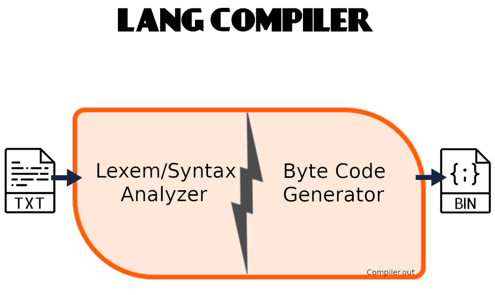
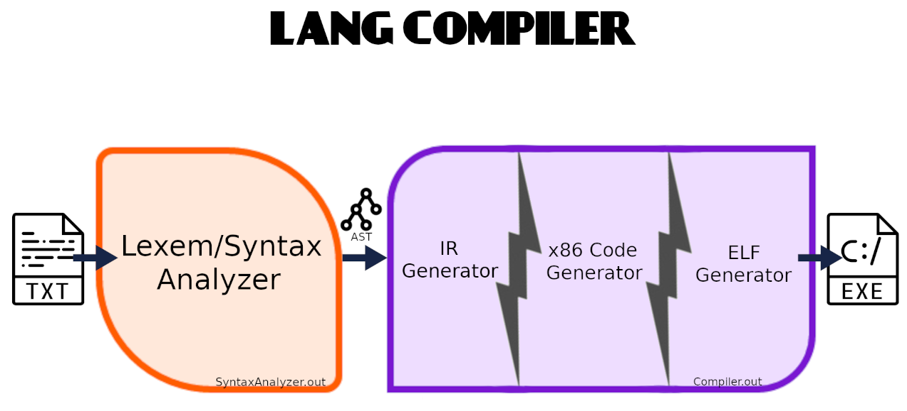

# Ускорение ПО путем замены формального исполнителя
_Выполнил Буторин Даниил_

## Введение
Одно из предыдущих заданий курса была реализация своего языка программирования.
Его компилятор генерировал байт-код для `softcpu` (тоже своего).
У него была следующая архитектура:



У приложений написанных на этом языке низкая скорость исполнения.
Так как язык у нас компилируем и без `runtime'а`, 
то ускорять его не получится (Разве что добавить оптимизации при генерации байт-кода). 

В силу задачи данной работы заменим формальный исполнитель на аппаратный процессор, 
что требует генерации машинного кода.

Из вариантов того, как можно перевести наш язык в машинный код:
- Транслировать байт-код в машинный код
- Транслировать АСД (абстрактное синтаксическое дерево) в машинный код

Первый вариант предоставляет нам два варианта компилятора: `JIT` (Just-In-Time) и `AOT` (Ahead-Of-Time).
`JIT` подразумевает, что байт-код приложения в `runtime'е` будет транслирован в машинный код, а потом исполнен.
`AOT` аналогичен `JIT`, но компилятор не исполняет код, а генерирует исполняемый файл на его основе.

Так как при генерации байт-кода мы не использовали оптимизаций, то данные технологии нам не интересны (У них крайне ограничены возможности к оптимизациям).

Поэтому рассмотрим второй вариант (Трансляция АСД в машинный код).
Так как нам интересны оптимизации кода, то будем использовать промежуточное представление, 
про которое можно узнать из "Dragon book"(aka "Компиляторы. Принципы, технологии и инструменты").

## Промежуточное представление

К реализации `IR'а` есть следующие варианты:
- Реализовать свой `IR`
- Использовать готовое проектное решение

Было принято решение использовать `IR` известного проекта - `llvm`.
Подробней про `llvm IR` можно прочитать в [LLVM Language Reference Manual](https://llvm.org/docs/LangRef.html).

Ниже будет представлено краткое описание `llvm IR`.
Он представляет собой трехадресный код.
Для наилучшего понимания вот общее представление такого кода:

```%Result = %Operand0 Operator %Operand1```

Исключением является команды перехода на ветку и возращения управления:

```
Br %Condition, %ThenBranch, %ElseBranch
Br %Branch 
Ret Null
Ret %Value
``` 

Также некоторые команды являются двухадресными.

Одна единица трансляции представляет собой модуль, который является множеством глобальных переменных и функций. 
Функция представляет собой множество базовых блоков. Базовый блок - это набор последовательно исполняемых инструкций. 


## Устройство компилятора

Текущий компилятор имеет следующую архитектуру:



## Устройство ELF файла

В силу того, что нам требуется простой исполняемый файл без динамического линкования, 
то будем использовать следующую структуру файла:

- ELF заголовок
- 4 заголовка программы (для кода, для библиотеки, для строковых литералов и для глобальных переменных)
- Сегмент кода и библиотеки
- Сегмент строковых литералов
- Сегмент глобальных переменных

Подробней про формат ELF файла можно прочитать [здесь](https://en.wikipedia.org/wiki/Executable_and_Linkable_Format).

## Оптимизации ```Code Gen'а``` 

В силу трехадресных инструкций в IR было принято решение использовать расширение SSE.

Самая очевидная оптимизация - хранения локальных переменных в регистрах.

Это можно достичь следующими способами:
- Посчитать вход/выход по регистрам для каждой инструкции
- Распределить регистры по базовом блокам

Первый вариант наилучший, но требует решения задачи раскраски графа.
Так как эта задача нетривиальная,
то было принято решение отказаться от данного способа в пользу второго варианта.

Стоит заметить, что второй вариант не учитывает межблочное использование регистров.  

Ниже будет представлен алгоритм распределения регистров для переменных.

В каждом базовом блоке считается популярность переменных и по составленному рейтингу переменные распределяются по регистрам в следующем порядке:
- Самые популярные заносятся в регистры
- Остальные заносятся в стек

Стоит заметить, что переменные, которые используются несколькими блоками, хранятся по следующему принципу:
- Читается из стека (если блок не первый)
- Участвует в составлении рейтинга как обычная переменная
- Используются по распределению рейтинга
- Записывается в стек (если блок не последний)

Также можем подметить, что такими переменными могут быть только переменные, 
перекачивавшие из языка высокого уровня.

Заметим, что использование глобальных переменных не оптимизируется (Все взаимодействия с ними проходят через память).

## ```Code Gen```

Подробней прочитать про кодирование команд на процессорах AMD можно прочитать здесь: 
[AMD64 Architecture Programmer’s Manual Volume 3: General-Purpose and System Instructions](https://www.amd.com/system/files/TechDocs/24594.pdf)

## Реализация стандартных функций

Так как в нашем языке предоставляется следующие функции: `sin`, `cos`, `tan`, `pow`, `sqrt`, то их надо реализовать.

Из вариантов есть:
- Использовать стандартную библиотеку C
- Использовать инструкции FPU
- Реализовать самому и записать вместе с кодом программы

Из-за простоты был выбран последний вариант.

Кроме того язык программирования предоставляет возможность вывода и ввода значения. Так как заранее известны вводимые и выводимые типы значений, 
то собственная реализация может быть слегка быстрей стандартной.

## Измерение ускорения

Так как мы поставили основную задачу - ускорение формального исполнения, то его надо замерить.

У `softcpu` будем замерять от момента чтения файла до конца исполнения программы.
А у `cpu` - от момента запуска в терминале до возвращения управления терминалу.

Для измерения будем использовать две версии программы, вычисляющей числа Фибоначчи: оптимизированная на уровне алгоритма и не оптимизированная.

<details>
<summary> Не оптимизированная версия </summary>

```kotlin
fun Fibonachi(n: Double): Double
{
  if (n < 3)
    return 1;
  return Fibonachi(n - 1) + Fibonachi(n - 2);
}

fun main(): Void
{
  Fibonachi(25);
}
```

</details>

<details>
<summary> Оптимизированная версия </summary>

```kotlin
fun Fibonachi(n: Double): Double
{
  if (n < 3)
    return 1;

  var  first: Double = 1;
  var second: Double = 1;

  var i = 0;
  while (i != n - 2)
  {
    var temp = first + second;
    first  = second;
    second =   temp;
    i = i + 1;
  }
  
  return second;
}

fun main(): Void
{
  Fibonachi(45);
}
```

</details>

Также измерим ускорение на программе, считающей корни квадратного уравнения.

<details>
<summary> Код </summary>

```kotlin
fun evalLine(k: Double, b: Double): Double
{
    if (k == 0)
      if (b == 0)
        return NaN;
      else
        return NaN;
    else
      return -b/k;
}

fun evalQuadra()
{
  var a: Double = 1;
  var b: Double = 2;
  var c: Double = 1;

  if (a == 0)
  {
    evalLine(b, c);
    return;
  }

  var D: Double = b*b - 4*a*c;

  if (D < 0)
    return;
  else if (D == 0)
    val root = -b/(2*a);
  else
  {
    D = sqrt(D);
    val  firstRoot = (-b+D)/(2*a);
    val secondRoot = (-b-D)/(2*a);
  }
  return;
}

fun main(): Void
{
  var n = 100;
   
  var i = 0;
  while (i != n)
  {
    evalQuadra();
    i = i + 1;
  }
}
```

</details>

Сырые данные будут представлены в следующей таблице(все измерения в us):

| CPU Type | App №1       | App №2  | App №3  |
| -------- | -----------| ------- | --------|
| Soft CPU | 26953422.6 | 3142.2  | 21366.8 |
| CPU      | 4418593.9  | 616.1   | 3502.8  |

Как и ожидалось аппаратный процессор исполняет код быстрей программного.

## Литература

- "Dragon book"(aka "Компиляторы. Принципы, технологии и инструменты")
- [LLVM Language Reference Manual](https://llvm.org/docs/LangRef.html)
- [Executable and Linkable Format](https://en.wikipedia.org/wiki/Executable_and_Linkable_Format)
- [AMD64 Architecture Programmer’s Manual Volume 3: General-Purpose and System Instructions](https://www.amd.com/system/files/TechDocs/24594.pdf)